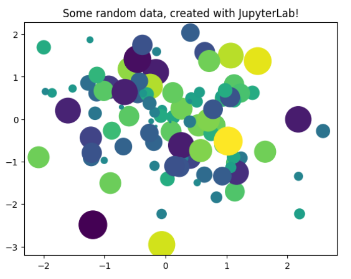

Hello! My name is **Zvoda Polina** and I'm an aspiring programmer from the Russian Federation, but now I'm studying in Barcelona on a semester exchange program.

*In this repository you can find a file with a Python code and a diagram. I took this file from the Jupiter Notebook official website from the Intro section. In addition, the repository contains the License and Wiki files.*

**Code:**

    from matplotlib import pyplot as plt
    import numpy as np

    # Generate 100 random data points along 3 dimensions
    x, y, scale = np.random.randn(3, 100)
    fig, ax = plt.subplots()

    # Map each onto a scatterplot we'll create with Matplotlib
    ax.scatter(x=x, y=y, c=scale, s=np.abs(scale)*500)
    ax.set(title="Some random data, created with JupyterLab!")
    plt.show()
    
This code is generating 100 random data points along 3 dimensions and visualizing them using a scatter plot created with Matplotlib, a Python data visualization library. Specifically, it is doing the following:

1) Importing the necessary libraries: Matplotlib and NumPy.
2) Generating 100 random data points for the x, y, and scale variables, each with a normal (Gaussian) distribution using NumPy's randn() function.
3) Creating a new figure and axes with plt.subplots(), which returns a tuple with the figure and the axes.
4) Mapping the random data points onto a scatter plot using the scatter() method of the axes object ax. The x and y variables represent the position of each point in the plot, and the scale variable is used to set the color and size of each point. The color (c) is set to the scale variable, and the size (s) is set to the absolute value of the scale variable multiplied by 500.
5) Setting the title of the plot using the set() method of the axes object.
6) Displaying the plot using plt.show().

Overall, this code is a simple example of how to use Matplotlib to generate a scatter plot from randomly generated data.

